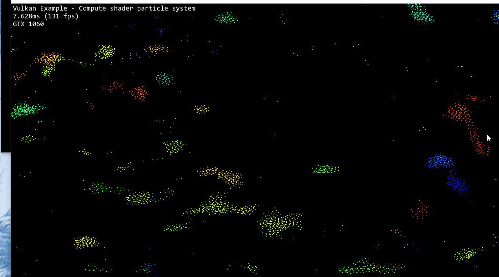

Vulkan Flocking: compute and shading in one pipeline!
======================

**University of Pennsylvania, CIS 565: GPU Programming and Architecture, Project 6**

* Xiang Deng
* Tested on:  Windows 10-Home, i7-6700U @ 2.6GHz 16GB, GTX 1060 6GB (Personal Computer)

[ ] 
  

### Credits

* [Vulkan examples and demos](https://github.com/SaschaWillems/Vulkan) by [@SaschaWillems](https://github.com/SaschaWillems)
